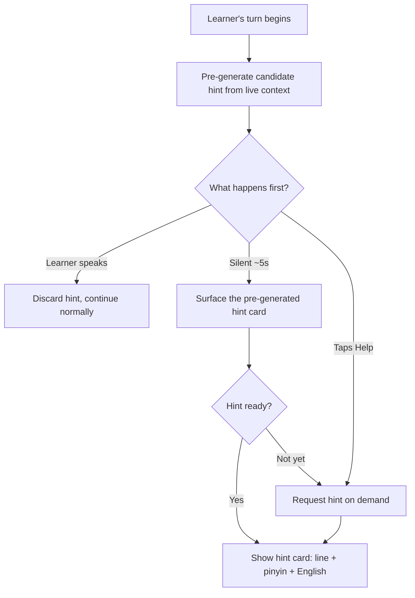

# Lingo

**Practice the conversations you actually freeze up in.**

Lingo is a guided speaking coach for real-world language practice. It is not just open-ended AI voice chat. Instead of asking an assistant to "practice Chinese," learners enter a structured mission with a language level, scenario, coaching style, and concrete success goal.

And when you do freeze, Lingo notices. If you go silent mid-conversation, it automatically surfaces a hint so you are never stranded looking for words. The freezes are not a failure state; they are detected and rescued in real time.

Example:

> B1 Mandarin, strict teacher, hotel check-in, goal: handle a room problem without switching to English.

Lingo then runs a short speaking drill with roleplay, correction, retry, scoring, and a next assignment. The goal is to make conversation practice feel more like a curriculum: focused, measurable, repeatable, and built around the moments learners actually struggle with.

## Positioning

**Duolingo-style missions for real conversations.**

Open-ended voice chat is useful, but it depends on the learner to create structure. Lingo gives the structure up front:

1. Warm-up phrase
2. Scenario setup
3. Live roleplay
4. Pronunciation checkpoint
5. Correction round
6. Retry the same moment
7. Score and next assignment

Running underneath the live roleplay (step 3) is an always-on safety net: freeze detection. If the learner goes silent for about five seconds when it is their turn, Lingo automatically pops a hint so the conversation keeps moving. It is not a separate step; it can fire any time the learner gets stuck.

The key product difference is the retry loop. Lingo does not only explain the mistake; it asks the learner to repeat the corrected phrase and compares the retry to the original attempt.

## Core Product Loops

### Scenario Loop

Every session is a concrete conversation mission with target phrases, grammar patterns, and success criteria.

Example missions:

- Order street food in Taipei.
- Explain a problem to a landlord.
- Interview for a product manager role.
- Make small talk with a coworker.
- Ask for directions to a pharmacy.
- Negotiate a later hotel checkout.

### Correction Loop

The learner speaks, the coach responds naturally, and Lingo captures the most important issues from the exchange. The learner then gets a short correction, repeats the improved phrase, and sees how the retry changed.

Corrections focus on:

- Pronunciation
- Grammar
- Vocabulary
- Fluency
- Confidence

### Progression Loop

Progress is based on speaking skills, not just time spent. Learners should be able to see specific strengths and weaknesses over time.

Examples:

- "You are improving at tones, but still weak on measure words."
- "You often hesitate when using numbers."
- "You avoid past-tense constructions."
- "You translate English word order into Mandarin."

### Habit Loop

Lingo is designed around short daily practice:

- Daily speaking streak
- 5-minute daily mission
- XP for completed conversations
- Fluency quests
- Skill unlocks based on mastery

Example fluency quests:

- Use 3 target words.
- Recover from 1 misunderstanding.
- Complete the mission without switching to English.
- Retry and improve one corrected phrase.
- Complete a no-hint run with no freeze hints triggered.

## Coaching Modes

Modes change the rules of the session, not just the tone.

### Strict Teacher

For deliberate practice and fast correction.

- Interrupts after key mistakes
- Demands retries
- Gives pronunciation drills
- Blocks progress until important phrases are fixed
- Keeps the learner in the target language as much as possible

### Friendly Travel Buddy

For confidence, survival communication, and flow.

- Keeps the conversation moving
- Corrects gently after the exchange
- Prioritizes being understood
- Encourages the learner to keep speaking
- Models better phrasing naturally

### Interviewer

For professional and high-pressure speaking practice.

- Asks realistic follow-up questions
- Evaluates clarity, structure, confidence, and filler words
- Pushes the learner to elaborate
- Gives a stronger version of the learner's answer
- Tracks recurring communication issues

## Signature Features

### Conversation Missions

Every session has a visible objective and a hidden rubric. The coach knows what the learner is trying to accomplish and pushes the conversation toward that goal.

### Live Correction Cards

During or after turns, Lingo shows focused correction cards:

- Pronunciation: "zh sounded closer to j."
- Grammar: "Use le after the completed action."
- Vocabulary: "Use yuding instead of ding when talking about reservations."
- Fluency: "Long pause before the verb."

Each card includes a way to practice the moment again.

### Retry the Same Moment

The learner repeats the corrected phrase immediately. Lingo compares the original attempt with the retry so improvement is visible in the session, not only in a later recap.

### Freeze Detection (Auto-Hint)

The moment learners actually dread is the silence in the middle of a real conversation, when it is their turn and nothing comes out. Lingo treats that silence as a signal instead of a dead end. The learner never has to ask for help; help arrives because they went quiet.

- Primary trigger: the learner is silent for about five seconds after it becomes their turn to speak. The hint surfaces automatically, with no button to press and no need to admit being stuck.
- Manual trigger and fallback: a Help button lets the learner request a hint at any time. It also acts as the fallback if the automatic hint is not ready the instant silence passes five seconds.
- Content: the suggested line in the target language, plus pinyin and an English translation, so the learner can read it aloud right away.
- After: the learner speaks the line and the normal roleplay, correction, and retry loops continue as usual.

Freeze detection is the forward-looking counterpart to the retry loop. The retry loop is backward help that turns a mistake you already made into a corrected attempt; freeze detection is forward help that gets words into your mouth before a stall turns into a wall. Together they keep the learner speaking from both directions.

#### How the Hint Is Generated

Hints are generated dynamically from the live conversation, not pulled from a fixed script. The coach model already has the full context it needs: the scenario, level, mode, mission goal, and running transcript. A hint is the single best next line the learner could say at this exact point in the roleplay.

To make the hint feel instant when silence hits, Lingo generates it ahead of time rather than after the freeze:

1. Proactive pre-generation. While it is the learner's turn, Lingo keeps a fresh candidate hint ready in the background, regenerated from the latest context whenever the conversation moves (each coach turn and any partial learner input). The line is prepared before it is ever needed.
2. Silence surfaces the prepared line. When the five-second freeze fires, Lingo bubbles up the already-generated hint immediately, so there is no visible wait.
3. Help button forces or fills in. If the learner taps Help, or if the pre-generated line is not ready yet, Lingo requests a hint on demand for the current moment.

Structurally, hint generation reuses the same pattern as corrections and scores. The coach emits the hint through a `suggest_hint` function tool (alongside `record_correction` and `score_turn`), the backend relays it to the client as an `lpp.hint` event, and the client renders it as a hint card. The tool returns the line in the target language plus pinyin and an English translation.

#### How Freeze Detection Works (GPT Realtime)

Lingo runs the live roleplay on GPT Realtime, which provides the signal used to detect a freeze. What "silence" means depends on the session's turn mode:

- Server VAD mode: GPT Realtime emits `input_audio_buffer.speech_started` when the learner starts speaking. The freeze timer starts when the coach finishes its turn (`response.done`) and is cancelled if `speech_started` arrives first.
- Push-to-talk mode (the current MVP client): there are no `speech_started` events, so "silent" means the coach has finished (`response.done`) and the learner has not begun their turn (no press of Hold to talk). The same five-second timer applies.

In both cases the freeze timer is a five-second client-side timer; the built-in `silence_duration_ms` setting (default 500ms) only decides when a single turn has ended and is far too short to represent a real freeze.

GPT Realtime also offers a native `idle_timeout_ms` option that emits an `input_audio_buffer.timeout_triggered` event after a configured silence. We avoid it for now because it is designed to automatically trigger a model response when it fires, whereas a freeze hint should be a silent on-screen card that the learner reads, not the coach jumping in and answering for them. The client-side timer keeps that control with us.

### Shadow Mode

The coach says a phrase and the learner repeats it. Lingo scores the attempt on pronunciation, rhythm, tones or stress, completeness, and confidence.

### Memory-Based Coaching

Lingo remembers recurring weaknesses and uses them to shape future missions.

Examples:

- "You often drop third tones."
- "You hesitate when using prices and dates."
- "You avoid complex sentences."
- "You need more practice recovering from misunderstandings."

### Speaking Skill Tree

Instead of a generic chat history, Lingo organizes practice around a speaking map:

- Greetings
- Ordering
- Directions
- Numbers and dates
- Opinions
- Storytelling
- Conflict resolution
- Interviews
- Humor and casual talk

Each skill can have drills, roleplays, and a mastery score.

## MVP Scope

The first version should be curated, not infinite. The product magic is the structured loop.

V1 should include:

- Three coaching modes
- A curated set of handcrafted scenarios
- Live conversation transcript
- Correction cards
- Freeze detection auto-hint
- Practice-again retry flow
- End-session score
- Daily streak
- User weakness memory

## Demo Path

The recommended demo mission:

> B1 Mandarin, strict teacher, hotel check-in, goal: handle a room problem without switching to English.

Demo flow:

1. Show the mission card with language level, mode, scenario, and success goal.
2. Start with a warm-up phrase and shadow practice.
3. Enter the hotel roleplay.
4. Make one intentional pronunciation or vocabulary mistake.
5. Show a correction card.
6. Retry the exact same phrase.
7. Show the before-and-after improvement.
8. Finish with a score, streak update, and next assignment based on the learner's weakness.

The strongest demo moment is the retry: Lingo should visibly turn a mistake into a corrected spoken attempt inside the same session.
