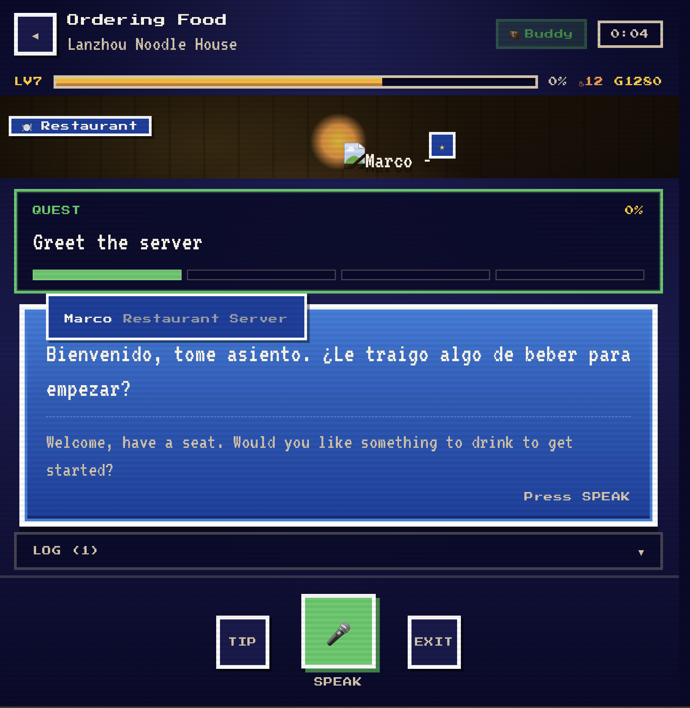
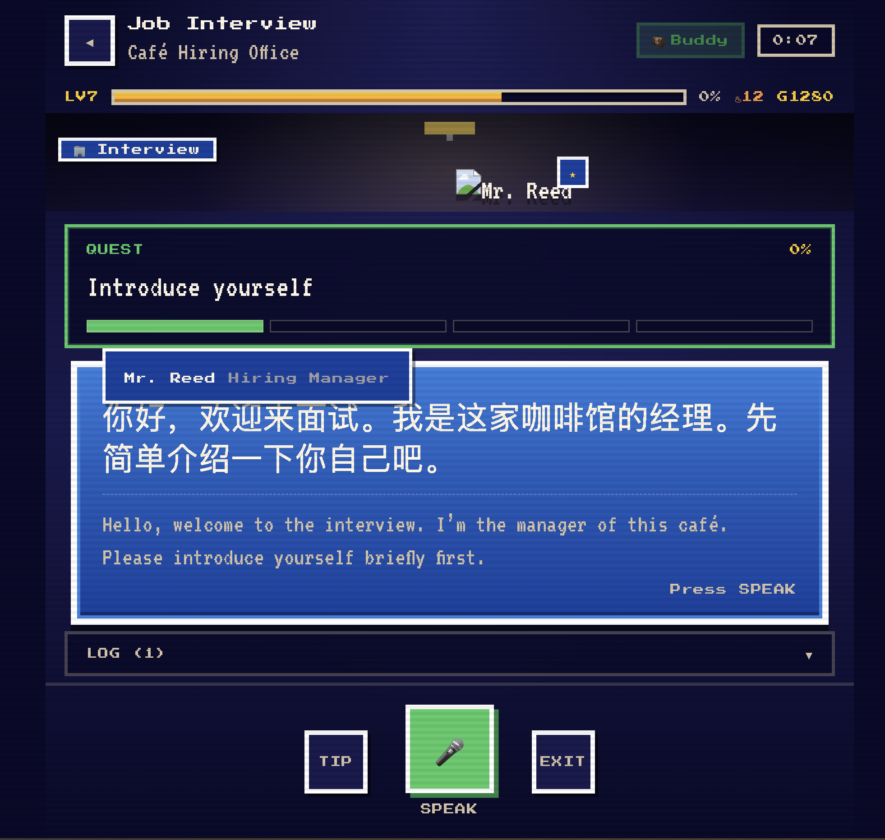
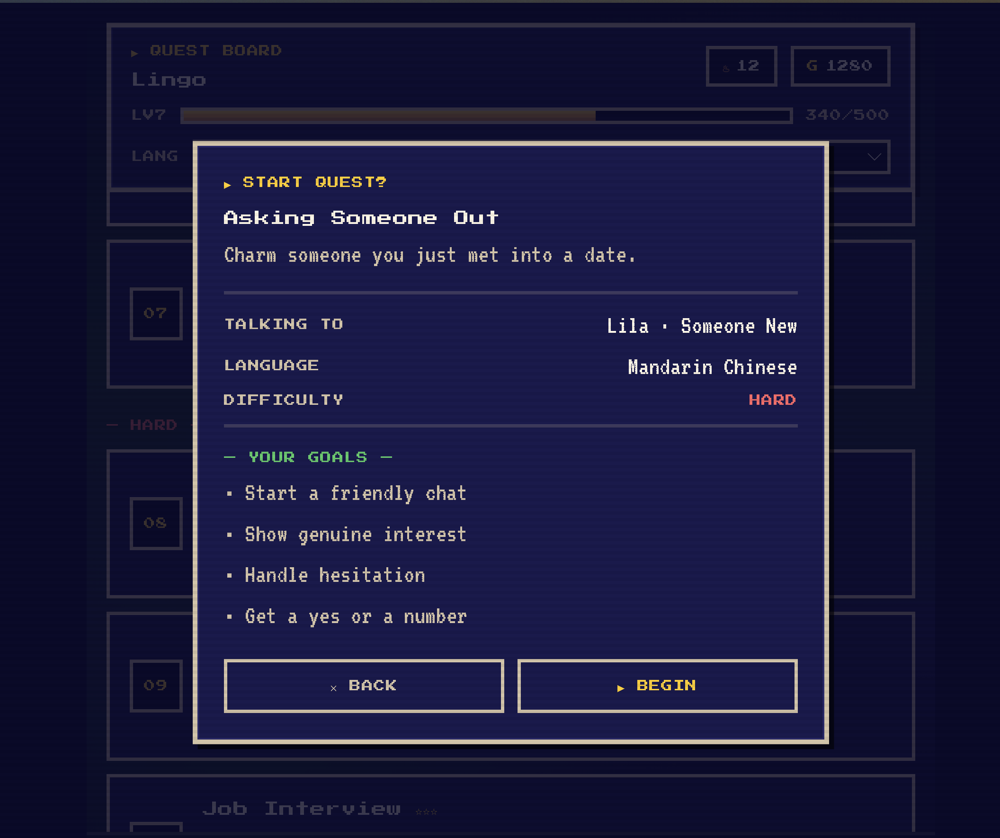

# Lingo — Team b16y

Hey cursor team! Here's the project we spent the last 2 hours working on, made with cursor's glass.

The tool is **lingo**, and the goal is to:
**Practice the conversations you actually freeze up in.**

Lingo is a guided speaking coach for real-world language practice. Instead of open-ended "practice Spanish with me" chat, every session is a structured mission — a language, level, scenario, and concrete goal — run as a live voice roleplay on GPT Realtime. The AI fully becomes an in-world character (a hotel clerk, an interviewer, a market vendor) who makes you genuinely earn the goal, while quietly logging corrections and scores in the background.

The repo is here, you can take a look. We are using `gpt-realtime-2` for the voice model. The project was made completely using cursor glass, using a mix of `opus-4.8` and `composer-2.5`

Video: https://drive.google.com/file/d/1Fn0gDLOm1d6JDYdOuvfUADOZGwxqO41l/view?usp=sharing

  
  

  

## Team Members

- Arjun Nanduri
- Alex Wang
- Matthew Rodrigues
- Scott Sahai
- Shaya Stark
